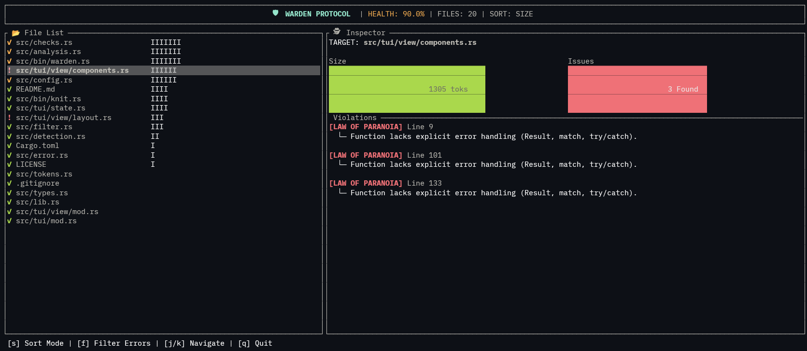

# 🛡️ Warden Protocol

**Architecture Governance based on NASA's "Power of 10".**

> *"The rules are like the seat belts in a car: Initially, using them is perhaps a little uncomfortable, but after a while, it becomes second nature, and not using them is unimaginable."* — Gerard J. Holzmann

Warden is a structural linter and "Architectural MRI" designed to enforce **High-Integrity Coding Standards**. It is a modern, multi-language adaptation of the **[NASA/JPL "Power of 10" Rules](https://web.eecs.umich.edu/~imarkov/10rules.pdf)** (Holzmann, 2006) for safety-critical software.

While originally designed for C, Warden adapts these principles for Rust, TypeScript, and Python to solve the "Context Drift" and "Complexity Creep" problems common in modern development (and AI-assisted workflows).

**v0.4.0 Update:** Now featuring a TUI Dashboard, Cyclomatic Complexity analysis, and a unified "Super Command" system.

---

## 📸 The Architectural MRI (TUI)

Warden includes a hardware-accelerated TUI to visualize codebase health in real-time.

```bash
warden --ui
```

<p align="center">
  
</p>

It features:
*   **Heatmap List:** Instantly spot complex files (Yellow) or violating files (Red).
*   **Mini-Gauges:** Inline visualization of file size vs. token budget.
*   **Compliance Stress:** A metric derived from the density of violations in a file.


---

## ⚡ The 3 Laws (Adapted from Holzmann)

Warden uses **Tree-sitter** to parse the AST and enforce:

### 1. The Law of Atomicity (Holzmann Rule 4)
*   **Rule:** No file may exceed **2000 Tokens** (approx. 60-100 logical statements).
*   **Original Rationale:** *"Each function should be a logical unit... verifiable as a unit."*
*   **Modern Benefit:** Forces modularity and ensures AI context windows remain high-signal.

### 2. The Law of Complexity (Holzmann Rules 1 & 2)
*   **Cyclomatic Complexity:** Max **10**. (Simple control flow).
*   **Nesting Depth:** Max **4**. (No "Arrow Code").
*   **Arity:** Max **5** arguments. (Enforces Data Structures).
*   **Original Rationale:** *"Simpler control flow translates into stronger capabilities for analysis."*

### 3. The Law of Paranoia (Holzmann Rules 5, 7, & 10)
*   **Rule:** Logic bodies must contain explicit error handling (`Result`, `try/catch`).
*   **Rule:** No `unwrap()` allowed. Zero Warnings tolerated.
*   **Original Rationale:** *"The odds of intercepting defects increase significantly with increasing assertion density."*

---

## 🚀 The "God Command"

Warden acts as a pipeline runner to enforce **Rule 10** (Pedantic Compilation).

**One command to rule them all:**
```bash
warden check
```

*Configured in `warden.toml`:*
```toml
[commands]
# Runs Clippy Pedantic -> If Pass -> Runs Warden Scan
check = "cargo clippy --all-targets -- -D warnings -D clippy::pedantic"
```

---

## 📦 Installation

```bash
cargo install --path . --force
```

## 🛠️ Configuration

Run `warden --init` to generate a `warden.toml` with NASA-standard defaults.

```toml
[rules]
max_file_tokens = 2000
max_cyclomatic_complexity = 10
max_nesting_depth = 4
```

## 🤖 The AI System Prompt

To enforce these rules with LLMs/Agents:

```text
ROLE: High-Integrity Systems Architect (Standard: JPL/Holzmann).
CONTEXT: You are coding inside a strict environment enforced by 'Warden'.

THE 3 LAWS (Non-Negotiable):
1. LAW OF ATOMICITY: Files < 200 Lines. Split VIEW from LOGIC.
2. LAW OF COMPLEXITY: Nesting < 4. Args < 5. Complexity < 10.
3. LAW OF PARANOIA: Validate inputs at Line 1. No unwrap(). Return Result<>.

OPERATIONAL PROTOCOL:
1. Scan: Read context.
2. Generate: Output WHOLE FILES.
3. Verify: "Will Warden reject this?"
```

**License:** MIT
